# User Flow Diagrams - Virtual Room Designer

## 1. Complete User Journey (High Level)

```mermaid
graph TD
    A["🏠 User Opens Virtual Room Designer"] --> B["📸 Upload Room Photo"]
    B --> C["🤖 AI Analyzes Room<br/>3-5 seconds"]
    C --> D["📊 See Recommendations<br/>5-8 furniture suggestions"]
    D --> E["🖱️ Drag & Drop Furniture<br/>to Canvas"]
    E --> F["🎯 Adjust Placement<br/>Position, Rotation, Scale"]
    F --> G{"Done<br/>Designing?"}
    G -->|No, Add More| E
    G -->|Yes| H["💾 Save Design"]
    H --> I["🛒 Add to Cart"]
    I --> J["💳 Checkout"]
    J --> K["✅ Order Confirmed"]
    
    style A fill:#e1f5ff
    style B fill:#fff3e0
    style C fill:#f3e5f5
    style D fill:#e8f5e9
    style E fill:#fce4ec
    style H fill:#f1f8e9
    style K fill:#c8e6c9
```

## 2. Upload & Analysis Flow

```mermaid
graph LR
    A["User Uploads Image"] --> B{"Validate<br/>File"}
    B -->|Valid| C["Store in Supabase<br/>Storage"]
    B -->|Invalid| D["❌ Show Error<br/>Max 10MB, JPG/PNG/WebP"]
    C --> E["Get Image URL"]
    E --> F["Send to AI API<br/>POST /api/room-analysis"]
    F --> G["🤖 OpenRouter<br/>Nemotron Model"]
    G --> H["Analyze Image"]
    H --> I["Match Catalog<br/>Items"]
    I --> J["Return<br/>Recommendations"]
    J --> K["Display in<br/>Furniture Palette"]
    
    D -.->|User Retries| A
    
    style A fill:#fff3e0
    style K fill:#e8f5e9
    style G fill:#f3e5f5
```

## 3. Drag & Drop Placement Flow

## 4. Properties Adjustment Flow

```mermaid
graph TD
    A["User Clicks Item<br/>on Canvas"] --> B["Item Selected<br/>Show Handles"]
    B --> C["Open Properties Panel"]
    C --> D{{"User Adjusts:"}}
    D --> E["📍 Position X/Y"]
    D --> F["🔄 Rotation 0-360°"]
    D --> G["📏 Scale 50%-150%"]
    D --> H["🎨 Color/Variant"]
    E --> I["Update State"]
    F --> I
    G --> I
    H --> I
    I --> J["Canvas Updates<br/>in Real-time"]
    J --> K["Visual Feedback<br/>Item moves/rotates/scales"]
    K --> L["Save on Focus Loss<br/>or 'Save Properties'"]
    
    style A fill:#fce4ec
    style C fill:#e3f2fd
    style J fill:#e8f5e9
    style L fill:#fff9c4
```

## 5. Save Design Flow

```mermaid
graph TD
    A["User Clicks<br/>Save Design"] --> B["Save Design Modal<br/>Opens"]
    B --> C["Enter Design Info:<br/>Name, Description"]
    C --> D["Choose Visibility:<br/>Private or Public"]
    D --> E["Review Preview<br/>Room image + items"]
    E --> F["Click Save"]
    F --> G["Validate Data"]
    G -->|Missing Name| H["❌ Error:<br/>Name Required"]
    G -->|Valid| I["Create Design Record"]
    H -.->|Fix| C
    I --> J["Generate Share Token<br/>if Public"]
    J --> K["Save to Supabase<br/>room_designs table"]
    K --> L["Store Design Data JSON:<br/>furniture placements<br/>settings"]
    L --> M["✅ Success"]
    M --> N["Show Confirmation"]
    N --> O["Option: View My Designs<br/>or Continue Editing"]
    
    style M fill:#c8e6c9
    style O fill:#fff9c4
```

## 6. Add to Cart & Checkout Flow

## 7. Complete System Architecture

## 8. Data State Flow

